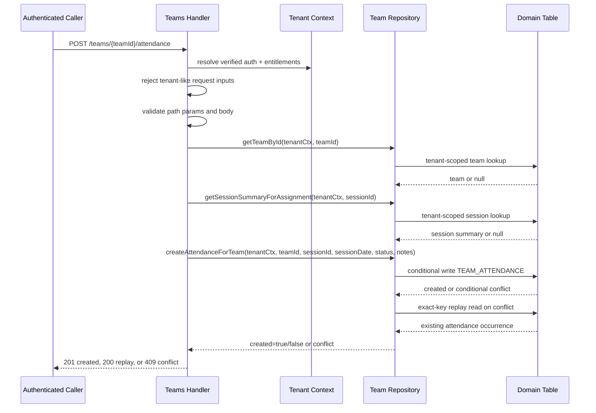
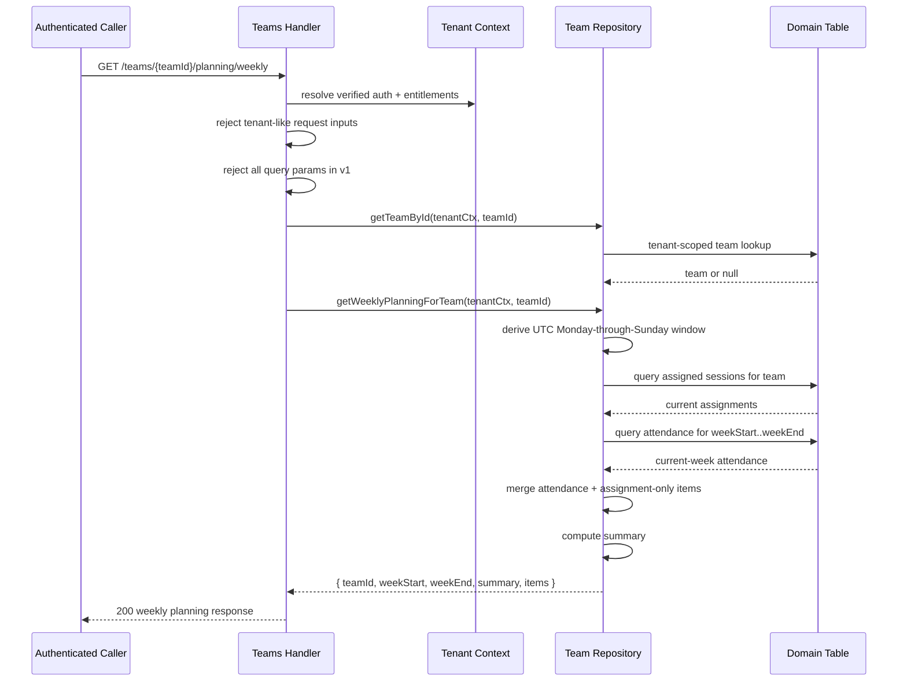

# Attendance System v1 Architecture

## Purpose and scope

This note documents the current shipped Attendance System v1 architecture in SIC.

It covers only the implemented Week 16 attendance and weekly planning slices:

- `POST /teams/{teamId}/attendance`
- `GET /teams/{teamId}/attendance`
- `GET /teams/{teamId}/planning/weekly`

This document is intentionally limited to the current implementation. It does not introduce new infrastructure, new IAM, new auth rules, tenancy-boundary changes, entitlements-model changes, a new table or GSI, or any redesign of the frozen Day 1 attendance contract and storage model.

The goal is to explain the smallest shipped attendance workflow and weekly planning read that currently exist and how they fit into SIC's coach-first Team Layer.

---

## Current Week 16 surface area

Week 16 currently adds a small operational attendance system on top of the existing Team Layer and saved-session model.

The current shipped/backend surface is:

- `POST /teams/{teamId}/attendance`
- `GET /teams/{teamId}/attendance`
- `GET /teams/{teamId}/planning/weekly`

This keeps the slice product-first and low-cost:

- it reuses the existing authenticated Team API surface
- it reuses the existing tenant-scoped saved-session model
- it reuses the existing `SIC_DOMAIN_TABLE`
- it composes weekly planning from existing assignment and attendance reads rather than adding a scheduler

The current implementation does not add:

- counts-based attendance
- athlete-level attendance
- roster logic
- recurrence
- a scheduler
- analytics expansion

---

## Attendance model

Attendance v1 is tracked at the team session occurrence level only.

Current normalized attendance payload fields are:

- `teamId`
- `sessionId`
- `sessionDate`
- `status`
- `notes` when present
- `recordedAt`
- `recordedBy`

Current status enum:

- `planned`
- `completed`
- `cancelled`

Current model rule:

- one attendance occurrence represents one team, one saved session, and one session date

Current duplicate rule:

- natural key = `teamId + sessionDate + sessionId`
- first create returns `201`
- exact normalized replay returns `200`
- conflicting replay returns `409 teams.attendance_exists`

Current implementation does not treat attendance as:

- counts-based attendance
- athlete-level attendance
- a roster event
- a scheduled recurring object

---

## Weekly planning read model

The weekly planning route is a thin composition read for one team.

Current route:

- `GET /teams/{teamId}/planning/weekly`

Current behavior:

- derive the current week server-side only
- use UTC Monday-through-Sunday bounds
- load the team's current assignments
- load the team's attendance occurrences for `weekStart..weekEnd`
- merge the two into one operational current-week view

Current composition rules:

- emit one `attendance` item per real attendance occurrence in the current week
- emit one `assignment` item per currently assigned session with no current-week attendance occurrence
- allow the same `sessionId` to appear multiple times when multiple real attendance occurrences exist in the current week
- never invent `sessionDate` for assignment-only items
- never invent `status` for assignment-only items
- never imply recurrence, cadence, or scheduled dates

Current top-level weekly planning response includes:

- `teamId`
- `weekStart`
- `weekEnd`
- `summary`
- `items`

Current `summary` fields are:

- `attendanceCount`
- `assignmentOnlyCount`
- `completedCount`
- `plannedCount`
- `cancelledCount`

Optional `sessionSummary` is limited to fields already present in the current assignment/session summary path:

- `sessionCreatedAt`
- `sport`
- `ageBand`
- `durationMin`
- `objectiveTags`

No `tenantId` is returned in the weekly planning response.

---

## Storage model

Attendance v1 stays in the existing `SIC_DOMAIN_TABLE`.

Current attendance item shape is tenant-scoped by construction:

- `PK = TENANT#<tenantId>`
- `SK = TEAMATTENDANCE#<teamId>#<sessionDate>#<sessionId>`
- `type = TEAM_ATTENDANCE`

Current stored attendance attributes are:

- `teamId`
- `sessionId`
- `sessionDate`
- `status`
- `notes` when present
- `recordedAt`
- `recordedBy`

Current storage reasons:

- it matches the existing Team and Session domain-table pattern
- it supports exact duplicate replay checks on the full key
- it supports team history queries
- it supports per-team date-window queries for weekly planning
- it requires no new table
- it requires no new GSI

Current query shapes remain tenant-scoped and query-based:

- team history:
  - `PK = TENANT#<tenantId>`
  - `begins_with(SK, "TEAMATTENDANCE#<teamId>#")`
- team date window:
  - `PK = TENANT#<tenantId>`
  - `SK BETWEEN TEAMATTENDANCE#<teamId>#<startDate># AND TEAMATTENDANCE#<teamId>#<endDate>#\uFFFF`

No scan-then-filter pattern is used.

---

## Request flow

### Attendance create flow

For `POST /teams/{teamId}/attendance`, the current flow is:

1. Authenticated request enters the existing JWT-protected Team route.
2. Verified identity resolves through the current auth path.
3. Tenant scope resolves from verified auth plus authoritative entitlements.
4. The handler rejects client-supplied tenant-like fields.
5. The handler validates path params and body fields.
6. The handler checks that the target team exists inside tenant scope.
7. The handler checks that the target saved session exists inside tenant scope.
8. The repository attempts a conditional write for the tenant-scoped attendance item.
9. On conditional failure, the repository performs an exact-key replay read.
10. The route returns `201`, `200`, or `409` based on the replay outcome.

### Attendance history flow

For `GET /teams/{teamId}/attendance`, the current flow is:

1. Authenticated request enters the Team route.
2. Tenant scope resolves from verified auth plus authoritative entitlements.
3. The handler rejects tenant-like fields from body, query, or headers.
4. The handler validates path params and supported attendance query params.
5. The handler checks that the target team exists inside tenant scope.
6. The repository performs a tenant-scoped query for history or a tenant-scoped date-window query.
7. The route returns the normalized attendance items and `nextToken` when present.

### Weekly planning read flow

For `GET /teams/{teamId}/planning/weekly`, the current flow is:

1. Authenticated request enters the Team route.
2. Tenant scope resolves from verified auth plus authoritative entitlements.
3. The handler rejects tenant-like fields from body, query, or headers.
4. The handler rejects all query params in v1.
5. The handler checks that the target team exists inside tenant scope.
6. The repository derives the current UTC Monday-through-Sunday week window.
7. The repository loads tenant-scoped current assignments for the team.
8. The repository loads tenant-scoped attendance occurrences for `weekStart..weekEnd`.
9. The repository merges attendance items and assignment-only items.
10. The repository computes the current `summary`.
11. The route returns the normalized weekly planning response.

---

## Failure behavior and consistency notes

The current Attendance System v1 routes use the existing platform error envelope.

### `400 platform.bad_request`

Used for:

- invalid JSON
- missing required path params
- invalid field types or values
- unknown request fields
- forbidden query params for weekly planning
- client-supplied tenant-like inputs such as `tenant_id`, `tenantId`, or `x-tenant-id`

### `401/403`

Used for:

- invalid or missing auth
- missing or invalid entitlements
- other current auth and entitlements failures

These remain governed by the existing auth and entitlements contract.

### `404 teams.not_found`

Used when the target team cannot be found inside the resolved tenant scope for:

- `POST /teams/{teamId}/attendance`
- `GET /teams/{teamId}/attendance`
- `GET /teams/{teamId}/planning/weekly`

### `404 sessions.not_found`

Used when `POST /teams/{teamId}/attendance` cannot find the referenced saved session inside the resolved tenant scope.

### `409 teams.attendance_exists`

Used when an attendance create attempt hits the same natural key but the normalized payload differs from the existing attendance occurrence.

### Consistency notes

- attendance duplicate handling is idempotent only for exact normalized replay on the natural key `teamId + sessionDate + sessionId`
- weekly planning is a read composition over current assignments plus current-week attendance
- weekly planning does not fabricate schedule objects or derived recurring occurrences

---

## Tenancy and security rules

These rules are non-negotiable and unchanged by Attendance System v1.

- tenant scope comes only from verified auth plus authoritative entitlements
- no request-derived tenant identity is accepted
- `tenant_id`, `tenantId`, and `x-tenant-id` are rejected from body, query, and headers
- team, session, assignment, and attendance access remain tenant-scoped by construction
- the weekly planning route verifies the target team in tenant scope before composition reads
- attendance create verifies both team and session in tenant scope before write behavior
- no scan-then-filter pattern is used
- fail-closed behavior is preserved

Current authorization note:

- Attendance System v1 does not introduce a new team-role model
- `401` and `403` behavior remains on the current platform auth and entitlements path

---

## Observability notes

Observability here is limited to what currently exists today.

Current route-level success events are:

- `team_attendance_recorded`
- `team_attendance_replayed`
- `team_attendance_listed`
- `team_weekly_planning_fetched`

Current scope limit:

- no dedicated Attendance System dashboard
- no dedicated alarm surface for this slice yet
- no analytics or reporting expansion beyond the current weekly planning summary counts

That is intentional for the current SIC stage.

---

## Sequence diagrams

### Attendance create sequence

### Weekly planning read sequence

---

## Current limitations and explicit deferrals

Current limitations:

- attendance remains occurrence-level only
- weekly planning remains a current-week operational read only
- `sessionSummary` remains limited to existing assignment/session summary fields
- no dedicated dashboard or alarm surface exists yet for this slice

Explicitly deferred:

- no schedule engine
- no recurrence system
- no timezone personalization
- no athlete-level attendance
- no roster dependency
- no cross-team weekly planning
- no analytics or reporting expansion beyond the current summary counts
- no notifications
- no new table or GSI
- no infra, IAM, auth-boundary, tenancy-boundary, or entitlements-model changes
- no Day 1 attendance contract or storage redesign
