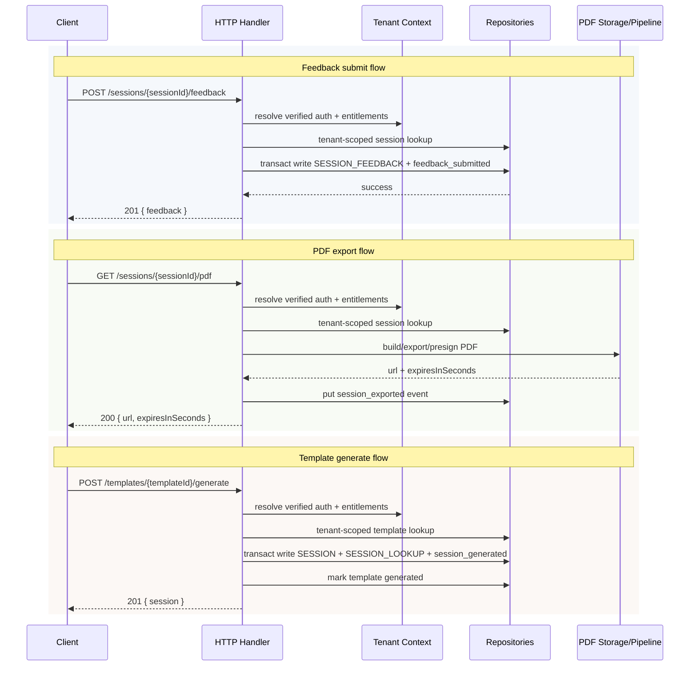

# SIC Feedback Loop Architecture

## Purpose and Scope

This document describes the current Week 20 feedback-loop architecture for Sports Intelligence Cloud (SIC).

It documents the narrow product slice that exists today:

- `POST /sessions/{sessionId}/feedback`
- tenant-scoped feedback persistence
- tenant-scoped session event persistence for:
  - `session_generated`
  - `session_exported`
  - `feedback_submitted`

This document is intentionally limited to the current implementation. It does not introduce new infrastructure, dashboards, read endpoints, IAM changes, auth-boundary changes, tenancy-boundary changes, or entitlements-model changes.

For the request/response contract of the feedback endpoint, see:

- `docs/api/session-feedback-v1-contract.md`

---

## Current Week 20 Surface Area

Week 20 adds a small backend-first pilot feedback refinement on top of the existing Session Builder and Templates flows.

The active backend surface is:

- `POST /sessions/{sessionId}/feedback`
- `GET /sessions/{sessionId}/pdf`
- `POST /templates/{templateId}/generate`

The current storage additions are:

- one tenant-scoped feedback record per session
- tenant-scoped session event items for the three supported product events above

There is no dedicated timeline read endpoint yet.
There is no dashboard yet.
There is no scheduled aggregation yet.

---

## Feedback Endpoint Summary

The feedback endpoint allows a coach workflow to submit bounded pilot feedback for an existing saved session.

Current behavior:

- route: `POST /sessions/{sessionId}/feedback`
- auth required through the existing JWT authorizer
- tenant scope resolved server-side from verified auth plus entitlements
- one feedback record per session
- duplicate feedback returns `409`
- session existence must be verified in the same tenant scope before feedback is written

Allowed feedback fields are documented in:

- `docs/api/session-feedback-v1-contract.md`

---

## Feedback Persistence Model

Feedback persistence is intentionally small and tenant-scoped by construction.

### Feedback item shape

- `PK = TENANT#<tenantId>`
- `SK = SESSIONFEEDBACK#<sessionId>`
- `type = SESSION_FEEDBACK`
- `sessionId`
- `submittedAt`
- `submittedBy`
- `sessionQuality`
- `drillUsefulness`
- `imageAnalysisAccuracy`
- `missingFeatures`
- optional `flowMode`
- `schemaVersion = 2`

### Persistence rule

- one feedback record per session
- second submission returns `409 sessions.feedback_exists`

### Consistency rule

Feedback and its feedback-related session event are written in the same DynamoDB transaction.

That means:

- successful feedback submission writes feedback plus `feedback_submitted` together
- duplicate feedback conflict prevents both the feedback write and the feedback event write

---

## Session Event Model

Session events are stored in the existing domain table.

### Event item shape

- `PK = TENANT#<tenantId>`
- `SK = SESSIONEVENT#<sessionId>#<occurredAt>#<eventType>`
- `type = SESSION_EVENT`
- `eventId`
- `sessionId`
- `eventType`
- `occurredAt`
- `actorUserId`
- `schemaVersion = 1`
- optional `metadata`

### Supported event types

- `session_generated`
- `session_exported`
- `feedback_submitted`

### Metadata rule

Metadata stays small and non-sensitive.

Current examples:

- `templateId`
- `exportFormat: "pdf"`
- `flowMode`
- `imageAnalysisAccuracy`

Current implementation does not store:

- presigned URLs
- PDF payloads
- copied request headers
- tenant identifiers from the request
- verbose coach free text in event metadata

---

## Exact Event Write Points

### 1. `feedback_submitted`

Write point:

- successful `POST /sessions/{sessionId}/feedback`

Behavior:

- written in the same tenant-scoped transaction as the `SESSION_FEEDBACK` item
- written for every successful feedback submission
- current metadata may include:
  - `flowMode`
  - `imageAnalysisAccuracy`

### 2. `session_exported`

Write point:

- successful `GET /sessions/{sessionId}/pdf`

Behavior:

- written only after export/presign preparation succeeds
- written as a standalone tenant-scoped event put
- current metadata is minimal:
  - `exportFormat: "pdf"`

### 3. `session_generated`

Write point:

- successful persisted template-based session generation in `POST /templates/{templateId}/generate`

Behavior:

- written in the same tenant-scoped transaction as session creation
- written only for persisted template generation
- not written for stateless `POST /session-packs`
- current metadata may include:
  - `templateId`

---

## Failure Behavior and Consistency Notes

### Feedback submit

- invalid request returns `400 platform.bad_request`
- missing target session in the resolved tenant scope returns `404 sessions.not_found`
- duplicate feedback returns `409 sessions.feedback_exists`
- feedback and `feedback_submitted` succeed or fail together inside one transaction

### PDF export

- missing target session returns `404 sessions.not_found`
- export failure does not write `session_exported`
- `session_exported` is written only after export/presign succeeds
- if the event write fails after export succeeds, the request fails and is logged through the existing error path

### Template generate

- missing template returns `404 templates.not_found`
- `session_generated` is only written when the persisted session create succeeds
- stateless pack generation remains separate and does not emit `session_generated`

---

## Observability Notes

Observability here is limited to what actually exists today.

Current signals include:

- structured Lambda request logs through the existing platform logger
- success log events such as:
  - `session_feedback_created`
  - `session_pdf_exported`
  - `template_generated`
- small feedback-specific metadata on `session_feedback_created`:
  - `feedback.flowMode`
  - `feedback.imageAnalysisAccuracy`
- existing platform error logging paths for request failures
- durable `SESSION_EVENT` items in the domain table

Current observability does not include:

- a dedicated feedback dashboard
- a dedicated timeline read API
- scheduled weekly summaries
- automated product analytics rollups

---

## Tenancy and Security Rules

These rules are non-negotiable and unchanged by Week 20.

- tenant scope comes only from verified auth plus authoritative entitlements
- no request-derived tenant identifier is trusted
- never accept `tenant_id` or `tenantId` from body, query, or headers
- never trust `x-tenant-id`
- feedback and event storage use tenant-scoped keys by construction
- session existence checks are tenant-scoped
- no scan-then-filter access pattern is used for feedback or session events

---

## Sequence Diagram

---

## Current Limitations and Explicit Deferrals

Current limitations:

- no session-event timeline read endpoint
- no coach-facing timeline UI
- no dashboard for feedback/event activity
- no app UI for Week 20 pilot feedback capture yet
- weekly review remains manual-first

Explicitly deferred:

- new read endpoints for timeline/history
- scheduled aggregation jobs
- dashboards and alarms specific to feedback/event review
- Athena-first analysis
- QuickSight-first reporting
- cross-tenant rollups
- ML or RAG analysis over feedback/event data
- broader analytics infrastructure not yet justified by current SIC usage
