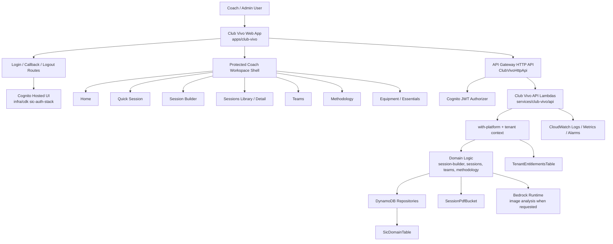
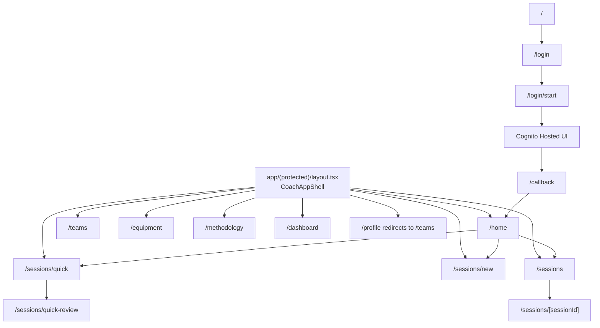
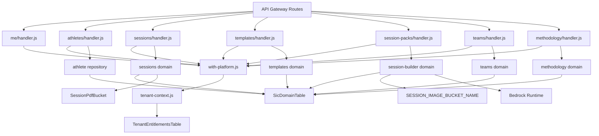
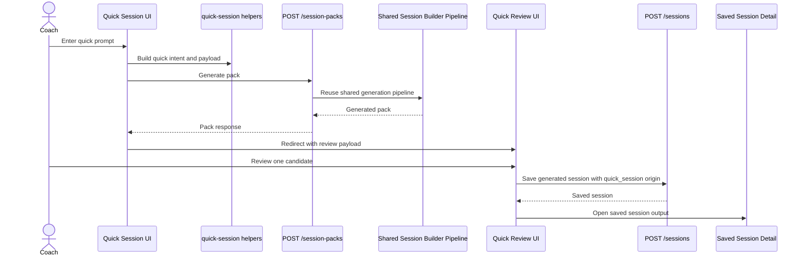
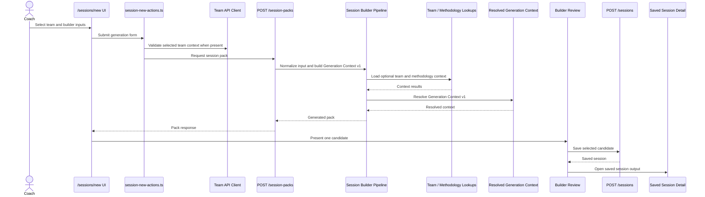
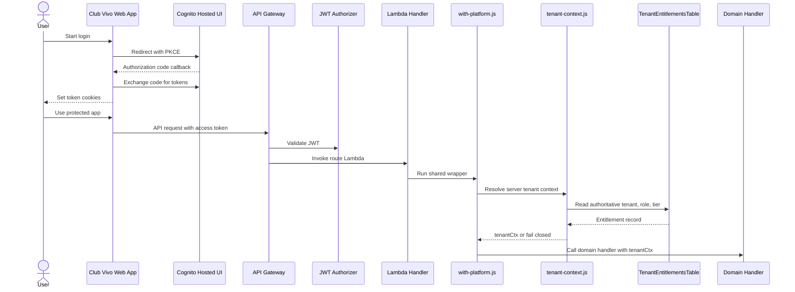
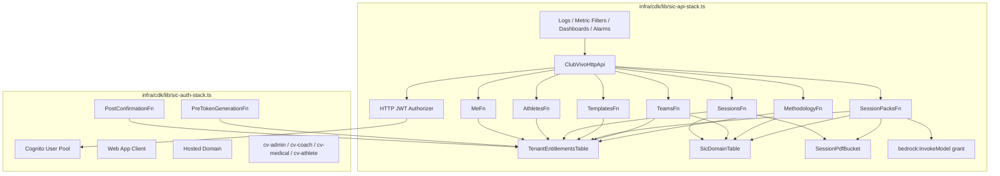

# SIC Current System Map

This document is the current source-based system map for Sports Intelligence Cloud / Club Vivo.

It uses the current repository as truth, with `docs/architecture/sic-repo-inventory.md` as the primary repo map. It does not propose file moves, deletions, renames, runtime changes, auth changes, tenancy changes, entitlement changes, IAM changes, CDK changes, API contract changes, or app behavior changes.

## 1. Purpose

This map explains how the current SIC / Club Vivo web app is built across frontend, backend, AWS infrastructure, data access, auth, and AI-assisted generation.

It is intended to help future architecture and repo reorganization work start from the system that exists now. It should be updated when the actual source structure or governing architecture changes through deliberate review.

## 2. High-Level System Overview

SIC currently runs as one shared coach-facing Club Vivo web app plus a serverless backend.

- `apps/club-vivo/`
  - Next.js web app for the Club Vivo coach workspace.
  - Contains public entry/login routes, protected workspace routes, coach UI components, and frontend API clients.
- `services/club-vivo/api/`
  - API Gateway Lambda handler source for Club Vivo backend routes.
  - Contains route handlers, platform wrappers, domain logic, repositories, validation, PDF export, and image-analysis integration code.
- `infra/cdk/`
  - CDK infrastructure for API Gateway, Lambda, DynamoDB, S3, Cognito integration, CloudWatch, IAM, and Bedrock permission grants.
- `services/auth/`
  - Cognito trigger Lambdas for post-confirmation provisioning and pre-token-generation claim enrichment.
- DynamoDB
  - `TenantEntitlementsTable` stores authoritative tenant, role, and tier entitlement records.
  - `SicDomainTable` stores domain records such as sessions, teams, methodology, athletes, templates, clubs, memberships, feedback, and event records.
- S3
  - `SessionPdfBucket` stores generated session PDFs.
  - The same bucket name is also passed to `SESSION_IMAGE_BUCKET_NAME` for the currently wired image source storage path used by image-analysis requests.
- Bedrock
  - `SessionPacksFn` is granted `bedrock:InvokeModel` for `amazon.nova-lite-v1:0`.
  - Source code uses Bedrock Runtime for image analysis inside the shared session-packs route when `requestType: "image-analysis"` is used.
- CloudWatch
  - API access logs, metric filters, dashboards, and alarms are defined in `infra/cdk/lib/sic-api-stack.ts`.

The current product direction remains one shared coach-facing app. There is no separate admin app in the current source.

## 3. Frontend Architecture

The active frontend runtime is `apps/club-vivo/`.

### Public Entry And Auth Routes

- `apps/club-vivo/app/page.tsx`
  - Public SIC / Club Vivo entry page.
- `apps/club-vivo/app/login/page.tsx`
  - Public sign-in page.
- `apps/club-vivo/app/login/start/route.ts`
  - Starts Cognito Hosted UI with PKCE cookies.
- `apps/club-vivo/app/callback/route.ts`
  - Exchanges Cognito authorization code and sets token cookies.
- `apps/club-vivo/app/logout/route.ts`
  - Clears auth cookies and redirects to login.
- `apps/club-vivo/middleware.ts`
  - Cookie-gates selected protected paths.

### Protected App Shell

- `apps/club-vivo/app/(protected)/layout.tsx`
  - Wraps protected pages in the coach workspace shell.
- `apps/club-vivo/components/coach/CoachAppShell.tsx`
  - Shared protected app frame.
- `apps/club-vivo/components/coach/CoachPrimaryNav.tsx`
  - Primary nav for Home, Session Builder, Methodology, Teams, Equipment, and Sessions.
- `apps/club-vivo/components/coach/CoachPageHeader.tsx`
  - Shared page header.

### Protected Workspace Routes

- Home
  - `apps/club-vivo/app/(protected)/home/page.tsx`
  - Uses `HomeSessionStartCard` and `RecentSessionsPanel`.
- Quick Session
  - `apps/club-vivo/app/(protected)/sessions/quick/page.tsx`
  - `apps/club-vivo/app/(protected)/sessions/quick-session-actions.ts`
  - `apps/club-vivo/app/(protected)/sessions/quick-review/page.tsx`
  - `apps/club-vivo/app/(protected)/sessions/quick-review/quick-session-review.tsx`
- Session Builder
  - `apps/club-vivo/app/(protected)/sessions/new/page.tsx`
  - `apps/club-vivo/app/(protected)/sessions/new/session-new-flow.tsx`
  - `apps/club-vivo/app/(protected)/sessions/new/session-new-actions.ts`
  - `apps/club-vivo/lib/session-builder-server.ts`
- Sessions library
  - `apps/club-vivo/app/(protected)/sessions/page.tsx`
  - `apps/club-vivo/components/coach/RecentSessionsPanel.tsx`
  - `apps/club-vivo/components/coach/ReuseFromLibraryEntry.tsx`
- Saved Session Detail
  - `apps/club-vivo/app/(protected)/sessions/[sessionId]/page.tsx`
  - `session-export-button.tsx`
  - `session-feedback-panel.tsx`
  - `quick-session-title-editor.tsx`
- Teams
  - `apps/club-vivo/app/(protected)/teams/page.tsx`
  - `apps/club-vivo/lib/team-api.ts`
  - `apps/club-vivo/components/coach/TeamSelector.tsx`
- Equipment/Essentials
  - `apps/club-vivo/app/(protected)/equipment/page.tsx`
  - `apps/club-vivo/components/coach/EquipmentEssentialsManager.tsx`
  - Browser-local support in `apps/club-vivo/lib/equipment-hints.ts`.
- Methodology
  - `apps/club-vivo/app/(protected)/methodology/page.tsx`
  - `apps/club-vivo/app/(protected)/methodology/methodology-workspace.tsx`
  - `apps/club-vivo/lib/methodology-api.ts`

## 4. Backend API Architecture

The active backend API source is `services/club-vivo/api/`.

### API Gateway Routes

Current CDK-wired routes in `infra/cdk/lib/sic-api-stack.ts` are:

- `GET /me`
- `POST /athletes`
- `GET /athletes`
- `GET /athletes/{athleteId}`
- `POST /sessions`
- `GET /sessions`
- `GET /sessions/{sessionId}`
- `GET /sessions/{sessionId}/pdf`
- `POST /sessions/{sessionId}/feedback`
- `POST /templates`
- `GET /templates`
- `POST /templates/{templateId}/generate`
- `POST /session-packs`
- `POST /teams`
- `GET /teams`
- `GET /teams/{teamId}`
- `PUT /teams/{teamId}`
- `GET /teams/{teamId}/sessions`
- `POST /teams/{teamId}/sessions/{sessionId}/assign`
- `GET /methodology/{scope}`
- `PUT /methodology/{scope}`
- `POST /methodology/{scope}/publish`

### Lambda Handler Folders

Current CDK-wired handler folders:

- `services/club-vivo/api/me/`
- `services/club-vivo/api/athletes/`
- `services/club-vivo/api/sessions/`
- `services/club-vivo/api/templates/`
- `services/club-vivo/api/session-packs/`
- `services/club-vivo/api/teams/`
- `services/club-vivo/api/methodology/`

Handler folders present but not found in the current CDK route list:

- `services/club-vivo/api/clubs/`
- `services/club-vivo/api/memberships/`
- `services/club-vivo/api/exports-domain/`
- `services/club-vivo/api/lake-ingest/`
- `services/club-vivo/api/lake-etl/`

Those areas need deeper review before cleanup because source and docs still reference export/lake workflows.

### Platform Wrapper And Tenant Context

- `services/club-vivo/api/src/platform/http/with-platform.js`
  - Shared Lambda wrapper for tenant-context resolution, logging, correlation, error normalization, and response shape.
- `services/club-vivo/api/src/platform/tenancy/tenant-context.js`
  - Builds tenant context from API Gateway JWT claims and the entitlements table.
- `services/club-vivo/api/src/platform/errors/errors.js`
  - Platform error classes and mappings.
- `services/club-vivo/api/src/platform/logging/logger.js`
  - Structured logging utilities.
- `services/club-vivo/api/src/platform/validation/validate.js`
  - Shared validation helpers.

### Domain Services And Repositories

Domain logic is under `services/club-vivo/api/src/domains/`.

- Session Builder
  - `session-builder/session-builder-pipeline.js`
  - `generation-context.js`
  - `generation-context-lookups.js`
  - `generation-context-resolver.js`
  - `session-pack-templates.js`
  - validation and image-intake parsing files.
- Sessions
  - `sessions/session-repository.js`
  - `sessions/session-feedback-service.js`
  - `sessions/session-feedback-validate.js`
  - `sessions/pdf/session-pdf.js`
  - `sessions/pdf/session-pdf-storage.js`
- Teams
  - `teams/team-repository.js`
  - team validation, session assignment, attendance, and weekly planning validators.
- Methodology
  - `methodology/methodology-service.js`
  - `methodology/methodology-repository.js`
  - `methodology/methodology-validate.js`
- Other repositories
  - athletes, templates, clubs, and memberships repositories.

### Backend Dependencies

- DynamoDB
  - Domain repositories read/write `SicDomainTable`.
  - Tenant context reads `TenantEntitlementsTable`.
- S3
  - PDF export uses `SessionPdfBucket`.
  - Image-analysis source storage currently uses `SESSION_IMAGE_BUCKET_NAME`.
- Bedrock
  - Image analysis uses Bedrock Runtime in `src/platform/bedrock/session-builder-image-analysis.js`.
- CloudWatch
  - Access logging, metric filters, dashboards, and alarms are defined in CDK.

## 5. Auth And Tenant Context Flow

Authentication uses Cognito Hosted UI and token cookies in the Club Vivo app.

1. The user starts login from the web app.
2. `apps/club-vivo/app/login/start/route.ts` redirects to Cognito Hosted UI with PKCE.
3. Cognito redirects back to `apps/club-vivo/app/callback/route.ts`.
4. The callback exchanges the authorization code and stores access/id token cookies.
5. Frontend API clients call API Gateway with the access token.
6. API Gateway uses the Cognito JWT authorizer defined in `infra/cdk/lib/sic-api-stack.ts`.
7. Lambda handlers run through `with-platform.js`.
8. `tenant-context.js` reads JWT claims and `TenantEntitlementsTable`.
9. Handlers and repositories receive server-built `tenantCtx`.

Tenant identity is never accepted from client input. The backend tenant context comes from JWT claims plus authoritative entitlements. Unknown or spoofed tenant input is rejected or ignored by the relevant validators/handlers, and missing identity or entitlement data fails closed.

## 6. Quick Session Flow

Quick Session is a fast shared-app lane, not a separate backend product.

Frontend source:

- `apps/club-vivo/app/(protected)/sessions/quick/page.tsx`
- `apps/club-vivo/app/(protected)/sessions/quick-session-actions.ts`
- `apps/club-vivo/app/(protected)/sessions/quick-review/page.tsx`
- `apps/club-vivo/app/(protected)/sessions/quick-review/quick-session-review.tsx`
- `apps/club-vivo/lib/quick-session-intent.ts`
- `apps/club-vivo/lib/quick-session-payload.ts`
- `apps/club-vivo/lib/quick-session-title-hints.ts`

Flow:

1. Coach enters a fast prompt.
2. Quick Session helpers derive an intent, duration, equipment hints, title, and payload.
3. The app reuses `POST /session-packs`.
4. The backend reuses the shared Session Builder pipeline.
5. The app stores review payload state for `/sessions/quick-review`.
6. Coach reviews the single generated candidate.
7. Saving reuses `POST /sessions`.
8. Saved detail renders origin-aware output as a Quick Session.

There is no separate Quick Session backend route, service, product, or data model in the current source.

## 7. Session Builder Flow

Session Builder is the deliberate shared generation path.

Frontend source:

- `apps/club-vivo/app/(protected)/sessions/new/page.tsx`
- `apps/club-vivo/app/(protected)/sessions/new/session-new-flow.tsx`
- `apps/club-vivo/app/(protected)/sessions/new/session-new-actions.ts`
- `apps/club-vivo/lib/session-builder-server.ts`
- `apps/club-vivo/lib/session-builder-api.ts`

Backend source:

- `services/club-vivo/api/session-packs/handler.js`
- `services/club-vivo/api/src/domains/session-builder/session-builder-pipeline.js`
- `generation-context.js`
- `generation-context-lookups.js`
- `generation-context-resolver.js`

Flow:

1. Coach opens `/sessions/new`.
2. The protected app loads team options and methodology context used by the builder UI.
3. Coach selects a team and enters builder inputs.
4. The server action validates the selected team through the app server/API client path before generation.
5. The app calls `POST /session-packs`; this does not widen the public contract for tenant identity.
6. The backend normalizes input and builds Generation Context v1.
7. The backend optionally loads team context and published methodology context.
8. The backend resolves Resolved Generation Context v1.
9. The pipeline plans and generates a session pack.
10. The UI presents one candidate for review.
11. Saving reuses `POST /sessions`.
12. Saved detail renders origin-aware output as a Session Builder session.

The current builder review UI intentionally uses one candidate from the generated pack.

## 8. Methodology Flow

Methodology v1 is a narrow text-only shared-app management path.

Frontend source:

- `apps/club-vivo/app/(protected)/methodology/page.tsx`
- `apps/club-vivo/app/(protected)/methodology/methodology-workspace.tsx`
- `apps/club-vivo/lib/methodology-api.ts`

Backend source:

- `services/club-vivo/api/methodology/handler.js`
- `services/club-vivo/api/src/domains/methodology/methodology-service.js`
- `services/club-vivo/api/src/domains/methodology/methodology-repository.js`
- `services/club-vivo/api/src/domains/methodology/methodology-validate.js`

Flow:

1. Coach or admin opens the Methodology page in the shared app.
2. The frontend calls `GET /methodology/{scope}` through the methodology API client.
3. The Methodology Lambda runs through the shared platform wrapper.
4. Methodology service/repository reads tenant-scoped methodology data from DynamoDB.
5. Admin users can save draft methodology text with `PUT /methodology/{scope}`.
6. Admin users can publish methodology with `POST /methodology/{scope}/publish`.
7. Session generation can load published methodology context through generation-context lookups.

No methodology upload, source-mode switching, RAG, vector ingestion, or admin app separation is implemented as shipped runtime behavior in the current source.

## 9. Teams Flow

Teams are managed in the shared protected Club Vivo app.

Frontend source:

- `apps/club-vivo/app/(protected)/teams/page.tsx`
- `apps/club-vivo/lib/team-api.ts`
- `apps/club-vivo/components/coach/TeamSelector.tsx`
- `apps/club-vivo/components/coach/SessionBuilderTopBlock.tsx`

Backend source:

- `services/club-vivo/api/teams/handler.js`
- `services/club-vivo/api/src/domains/teams/team-repository.js`
- team validation and assignment validators under `services/club-vivo/api/src/domains/teams/`

Flow:

1. Coach opens Teams in the shared protected app.
2. Frontend calls the Teams API client.
3. API Gateway invokes the Teams Lambda.
4. The platform wrapper resolves tenant/user context.
5. Team repository reads/writes team records in `SicDomainTable`.
6. Coach-owned team behavior is enforced in the repository/handler layer.
7. Admin users retain tenant-wide visibility where that behavior is implemented.
8. Team context can be loaded into session generation as server-validated context.

Non-owner access returns not found where ownership applies.

## 10. Saved Sessions / Feedback / PDF Export Flow

Saved sessions are handled through the shared Sessions API and repository.

Frontend source:

- `apps/club-vivo/app/(protected)/sessions/page.tsx`
- `apps/club-vivo/app/(protected)/sessions/[sessionId]/page.tsx`
- `apps/club-vivo/app/(protected)/sessions/[sessionId]/session-feedback-panel.tsx`
- `apps/club-vivo/app/(protected)/sessions/[sessionId]/session-export-button.tsx`
- `apps/club-vivo/lib/session-builder-api.ts`

Backend source:

- `services/club-vivo/api/sessions/handler.js`
- `services/club-vivo/api/src/domains/sessions/session-repository.js`
- `services/club-vivo/api/src/domains/sessions/session-feedback-service.js`
- `services/club-vivo/api/src/domains/sessions/session-feedback-validate.js`
- `services/club-vivo/api/src/domains/sessions/pdf/session-pdf.js`
- `services/club-vivo/api/src/domains/sessions/pdf/session-pdf-storage.js`

Flow:

1. Sessions library calls `GET /sessions`.
2. Session detail calls `GET /sessions/{sessionId}`.
3. Creating a saved session uses `POST /sessions`.
4. Feedback uses `POST /sessions/{sessionId}/feedback`.
5. Feedback validation and service code write feedback records through the session repository.
6. PDF export uses `GET /sessions/{sessionId}/pdf`.
7. The Sessions Lambda creates a minimal PDF buffer and stores it through PDF storage.
8. PDF storage writes to `SessionPdfBucket` and returns a presigned URL.

The current PDF flow exists as a functional export action. Deeper PDF document design is not complete in the current source map.

## 11. AWS Resource Map

AWS resources are defined in `infra/cdk/`.

- API Gateway
  - `infra/cdk/lib/sic-api-stack.ts`
  - `ClubVivoHttpApi`
  - Cognito JWT authorizer
- Lambda functions
  - `MeFn`
  - `AthletesFn`
  - `SessionsFn`
  - `TemplatesFn`
  - `SessionPacksFn`
  - `TeamsFn`
  - `MethodologyFn`
  - Auth triggers in `infra/cdk/lib/sic-auth-stack.ts`
- DynamoDB tables
  - `TenantEntitlementsTable`
  - `SicDomainTable`
- S3 buckets
  - `SessionPdfBucket`
  - Also passed as `SESSION_IMAGE_BUCKET_NAME` for current image source storage.
- Cognito
  - `infra/cdk/lib/sic-auth-stack.ts`
  - User pool, app client, hosted domain, groups, post-confirmation trigger, pre-token-generation trigger.
- Bedrock permissions
  - `infra/cdk/lib/sic-api-stack.ts`
  - `bedrock:InvokeModel` grant for `amazon.nova-lite-v1:0` to `SessionPacksFn`.
- CloudWatch logs, metrics, dashboards, alarms
  - `infra/cdk/lib/sic-api-stack.ts`
- IAM permissions
  - Explicit grants in `infra/cdk/lib/sic-api-stack.ts` and `infra/cdk/lib/sic-auth-stack.ts`.

## 12. Mermaid Diagrams

These diagrams are source-based and intentionally conservative.

### Full System Map

### Frontend Route Map

### Backend API / Domain / Data Map

### Quick Session Sequence

### Session Builder Sequence

### Auth / Tenant Context Sequence

### AWS Resource Map

## 13. Diagram Export Note

This markdown file is the current text source of truth for the system map.

Future official visual diagrams may live under:

- `docs/architecture/diagrams/`

Those diagrams may be recreated in Miro or draw.io for presentation, but they should remain traceable to this markdown source and the current repo source.

## 14. Open Questions / Next Map Improvements

- Determine whether domain export and lake code is historical, parked, or active outside the current CDK stack.
- Decide whether `apps/club-vivo/app/(protected)/sessions/coach-lite-preview/` should remain in the active app tree.
- Future SIC-wide product concepts now live under `docs/product/future/`; keep `apps/` focused on active app surfaces.
- Review whether the source-of-truth order needs a new roadmap/governance document now that work is moving away from week-based planning.
- Consider whether future official visual diagrams should be generated under `docs/architecture/diagrams/` and cross-linked from this map.
