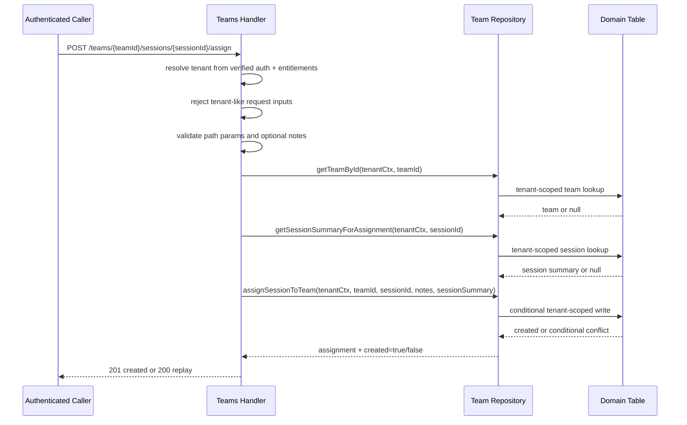

# Team Layer v1 Architecture

## Purpose and scope

This note documents the current shipped Team Layer v1 architecture in SIC.

It covers only the implemented Week 15 Team Layer slices:

- Day 1 team model and core endpoints
- Day 2 session-assignment workflow

This note does not define broader club/platform behavior, future team product scope, new UI, analytics, or any new infrastructure surface.

The goal is to explain the smallest shipped Team Layer that currently exists and how it fits into the coach-first SIC product path.

---

## Current shipped Team Layer v1

The current shipped Team Layer v1 gives SIC two narrow capabilities:

- create and read tenant-scoped team records
- assign an existing saved session to a tenant-scoped team and list those assignments

This keeps the slice product-first and low-cost:

- it reuses the existing authenticated API surface
- it reuses the existing saved-session model rather than introducing a separate planner
- it keeps team workflows small enough for a solo builder to validate manually

---

## Current shipped routes

### `POST /teams`

Purpose:
- Create a tenant-scoped team record.

Current implementation note:
- This route is currently admin-only.

### `GET /teams`

Purpose:
- List tenant-scoped teams.

### `GET /teams/{teamId}`

Purpose:
- Fetch one tenant-scoped team by id.

### `POST /teams/{teamId}/sessions/{sessionId}/assign`

Purpose:
- Assign one existing saved session to one tenant-scoped team.
- Persist a tenant-scoped team-session mapping.
- Preserve idempotent replay if the same assignment is submitted again.

### `GET /teams/{teamId}/sessions`

Purpose:
- List the currently assigned sessions for one tenant-scoped team.

---

## Team model

The current team model is intentionally small.

Current normalized team payload fields:

- `teamId`
- `tenantId`
- `name`
- `sport`
- `ageBand`
- `level` when present
- `notes` when present
- `status`
- `createdAt`
- `updatedAt`
- `createdBy`

Persistence shape by construction:

- `PK = TENANT#<tenantId>`
- `SK = TEAM#<teamId>`

This model is deliberately narrow. It does not yet include:

- roster membership
- attendance
- scheduling
- club hierarchy
- team analytics

---

## Assignment model

The current assignment model is a tenant-scoped mapping between one team and one saved session.

Current normalized assignment payload fields:

- `teamId`
- `sessionId`
- `assignedAt`
- `assignedBy`
- `notes` when present
- `sessionCreatedAt` when present
- `sport` when present
- `ageBand` when present
- `durationMin` when present
- `objectiveTags` when present

Persistence shape by construction:

- `PK = TENANT#<tenantId>`
- `SK = TEAMSESSION#<teamId>#<sessionId>`

Current behavioral rule:

- the same `teamId + sessionId` pair is idempotent
- first assign returns `201`
- duplicate replay returns `200` with the existing assignment payload

The current implementation also performs a tenant-scoped session lookup before assignment using the existing saved-session lookup path. The Team Layer does not introduce a second session source of truth.

---

## Request flow

### Team create / read flow

For the shipped team routes, the flow is:

1. Authenticated request enters the existing JWT-protected route.
2. Verified identity resolves through the current platform auth path.
3. Tenant scope resolves from verified auth plus server-side entitlements.
4. The handler rejects any client-supplied tenant-like fields.
5. The handler validates path/query/body inputs.
6. The repository performs tenant-scoped access by construction.
7. The route returns the normalized response payload.

### Assignment flow

For `POST /teams/{teamId}/sessions/{sessionId}/assign`, the current flow is:

1. Authenticated request enters the route.
2. Tenant scope resolves from verified auth plus server-side entitlements.
3. The handler rejects tenant-like fields from body, query, or headers.
4. The handler validates required path params and optional body fields.
5. The repository checks that the target team exists inside tenant scope.
6. The repository checks that the target saved session exists inside tenant scope.
7. The repository attempts a tenant-scoped conditional write for the assignment.
8. If the assignment already exists, the existing assignment is returned as an idempotent replay.

---

## Failure behavior

The current Team Layer routes use the platform error envelope.

### `400 platform.bad_request`

Used for:

- invalid JSON
- missing required path params
- invalid field types or values
- unknown request fields
- client-supplied tenant-like inputs

### `403 teams.admin_required`

Used for:

- non-admin calls to `POST /teams`

### `404 teams.not_found`

Used when the target team cannot be found inside the resolved tenant scope for:

- `GET /teams/{teamId}`
- `POST /teams/{teamId}/sessions/{sessionId}/assign`
- `GET /teams/{teamId}/sessions`

### `404 sessions.not_found`

Used when `POST /teams/{teamId}/sessions/{sessionId}/assign` cannot find the target saved session inside the resolved tenant scope.

---

## Tenancy and security rules

The current Team Layer follows the existing SIC tenancy contract.

Non-negotiable rules that apply here:

- tenant scope is server-derived from verified auth plus entitlements
- no request-derived tenant identity is accepted
- `tenant_id`, `tenantId`, and `x-tenant-id` are rejected from body, query, and headers
- reads and writes are tenant-scoped by construction
- no scan-then-filter pattern is used
- fail-closed behavior is preserved

Current authorization note:

- `POST /teams` is admin-only
- current shipped read and assignment routes are authenticated and tenant-scoped, but do not add a broader team-role model yet

---

## Observability notes

This slice uses the existing platform logging path only.

Current route-level success events:

- `team_created`
- `team_listed`
- `team_fetched`
- `team_session_assigned`
- `team_session_assignment_replayed`
- `team_sessions_listed`

Current scope limit:

- no dedicated Team Layer dashboard
- no new alarm surface
- no analytics expansion

That is intentional for the current SIC stage.

---

## Assign Sequence

---

## Explicitly deferred

These items are intentionally outside current shipped Team Layer v1:

- unassign flows
- assignment replacement semantics
- session ordering or calendar scheduling
- attendance and completion tracking
- roster or membership management
- broader team authorization redesign
- club-level rollups or platform-level workflows
- dashboards, analytics, or reporting
- new UI surfaces for team workflows
- new infrastructure, IAM, auth-boundary, tenancy-boundary, or entitlements-model changes

---

## Current shipped Team Layer v1 vs future team features

Current shipped Team Layer v1 is only:

- a small tenant-scoped team model
- a small tenant-scoped team-session assignment model
- five authenticated API routes
- current log evidence through the existing platform logging path

Future team features should be treated as separate follow-on work, not implied by this note.
